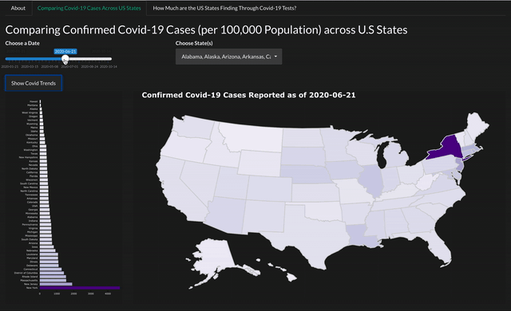

<!-- README.md is generated from README.Rmd. Please edit that file -->

# covid19usa 

<!-- badges: start -->

<!-- badges: end -->

The goal of the `covid19usa` package is to provide an embedded
interactive R Shiny web application for key data visualisation of
Covid-19 cases and testing efficiency across the U.S states. This
package is built by refactoring the user-interface and server-side logic
of a previously developed shiny web application for ‘ETC5523: Shiny
Assessment’.

## Installation

You can install the development version from
[GitHub](https://github.com/etc5523-2020/r-package-assessment-BrendiA)
with:

``` r
# install.packages("devtools")
devtools::install_github("etc5523-2020/r-package-assessment-BrendiA")
```

# Get Started

To load the shiny web application:

``` r
library(covid19usa)

# Load shiny application
launch_app()
```

## Overview

The interactive features of the Shiny application allow for a more
personalised user experience, to explore as little or as much of the
analysed data. In all tabs, you can make use of the slider input and
drop-down list to manoeuvre between dates and states across the United
States to visualise how the Covid-19 trajectories changes with these
inputs.



As the video suggests, the first component of the Shiny application
includes a Choropleth map that displays the statistical data of the
total cases across each U.S. state on a given date. It is made with a
sequential colour scale to establish the geographical location of the
states with the highest total confirmed cases. This trend is also
plotted on a histogram next to the map for better comparison.


Covid-19 testing promotes early detection of community-acquired Covid-19
cases, which can support public health response to the pandemic such as
the allocation of resources for the more vulnerable regions. This
section consists of two tabs. The first tab measures the percentage of
Covid-19 tests returning positive on a given date, and is charted on the
a Choropleth map. Correspondingly, the second segment depicts the
aggregated test results as of the chosen date selected by the user, and
is charted on an interactive table.

# Learn More About the Package and Functions

Refer to the [pkgdown
website](https://etc5523-2020.github.io/r-package-assessment-BrendiA/)
to learn more about the package’s functions. It also includes a
[vignette](https://etc5523-2020.github.io/r-package-assessment-BrendiA/)
that covers a comprehensive guide on how to launch the app, along with
the functionalities and guidelines for its use.
