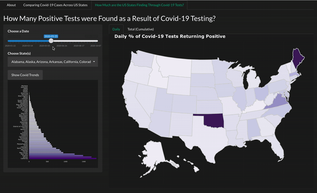

```{r setup, include = FALSE}
knitr::opts_chunk$set(
  collapse = TRUE,
  comment = "#>",
  fig.align = "left"
)
```

# Getting Started

Essentially, the `covid19usa` package serves as a container for a Shiny Application. This vignette will describe how you can launch the application, and outline the analysis you can do with the app. It will also describe the additional datasets and functions embedded in the R package.

## Launching the Shiny Application

Prior to launching the application, you are required to load/download the R package:

```{r library}
library(covid19usa) # devtools::install_github("etc5523-2020/r-package-assessment-BrendiA")
```

Next, the Shiny web application can be launched with a single line of code:

```{r launch-app, eval = FALSE}
launch_app()
```

# Using the Shiny Application

## About

The Shiny app open with an 'About' tab. It establishes the purpose of the Shiny app, the source and references used to produce the application.

## Comparing Confirmed Covid-19 Cases (per 100,000 Population) across U.S States


The first component of the application allows you to compare the total number of confirmed Covid-19 cases (per 100,000 population) reported by each U.S state. As the video suggests, the slider input and the input slots allow you to manoeuvre between each date and the different U.S states respectively for a more tailored analysis.

The interactive Choropleth map is implemented with a sequential colour scale to establish the geographical location of the states with the highest total confirmed cases on a given date. Additionally, this trend is also plotted on a histogram on the sidebar panel, as the comparison between states can be better articulated since people are generally better at comparing lengths on a common scale as compared to shading or colour saturations.

When you hover your mouse over to a state on the map, you will retrieve the following:

-   Date

-   State

-   Total cases (per 100,000 population)

-   Total deaths (per 100,000 population)

-   Population

## Positive Covid-19 Cases found via Covid-19 Testing



The last component of the app allows you to examine the positive cases declared as a result of testing across each U.S states. Like in the previous tab, you can access the slider input and input slots to select dates and U.S. states respectively.

This component consists of two tabs. The first tab, looks at the daily positive cases found through Covid-19 testing on a given date (*i.e.* daily basis), and like the previous component, an interactive Choropleth map and the corresponding bar chart is plotted. The other tab illustrates the accumulated positive cases found through testing on an interactive table. This allows for easy comparison between daily and accumulated cases. To note, occasional anomalies (e.g. significant drop in tests) can be seen generally due to case definitions and non-reporting.

When you hover your mouse over to a state on the Choropleth map, you will retrieve the following:

-   Date

-   State

-   Tests conducted

-   New cases

-   Proportion of Covid-19 tests returning positive

A snippet of the variables included DT table is charted below:

```{r, message = FALSE}
library(dplyr)
library(kableExtra)

DT <- covid19usa::create_datatable()
DT <- DT[[2]]
DT %>% 
  arrange(desc(Date, State)) %>%
  head(10) %>%
  kableExtra::kable() %>%
  kableExtra::kable_styling(bootstrap_options = c("bordered", "hover"))
```

# Additional Datasets

The clean raw datasets can be retrieved with theses functions embedded in the package:

`covid_us_states`: Contains the Covid-19 cases and deaths (per 100,000 population) on a given date across each U.S state. **Retrieved from [The New York Times](https://github.com/nytimes/covid-19-data).**

`tests_raw`: Contains the daily and accumulated Covid-19 testing and cases on a given date across each U.S. state. The data quality variable is also provided to illustrate data completeness of the testing data in each state. **Retrieved from [Covidtracking.com](https://covidtracking.com/data).**

`us_pop_ests`: Contains the FIPS code and the total population for each U.S state. **Retrieved from [The New York Times](https://github.com/nytimes/covid-19-data).**

`us_states_map`: Contains the geographical coordinates for each state, primarily used for relational joins. **Retrieved from the `usmap` R package**

These datasets are combined with the U.S spatial data to provide an interactive map and other data visualisations to allow users to explore Covid-19 cases across the U.S. Due to the large size in data, the combined dataset are stored in a list and can be retrieved with these functions:

Contains the spatial data for the daily and accumulated Covid-19 cases across each U.S state:

```{r eval = FALSE}
list <- create_map_data()
list[[1]] # Accumulated Covid-19 cases spatial data
list[[2]] # Daily Covid-19 cases spatial data
```

Contains the data for the daily and accumulated Covid-19 positive cases found through testing across each U.S state, along with each U.S state's respective data quality grades:

```{r, eval = FALSE}
list <- create_datatable()
list[[1]] # Positive cases found through testing
list[[2]] # For interactive table
```

# More Details

More information about the functions embedded in the R package for the Shiny application can be found in the reference section of the [pkgdown site](https://etc5523-2020.github.io/r-package-assessment-BrendiA/reference/index.html).
